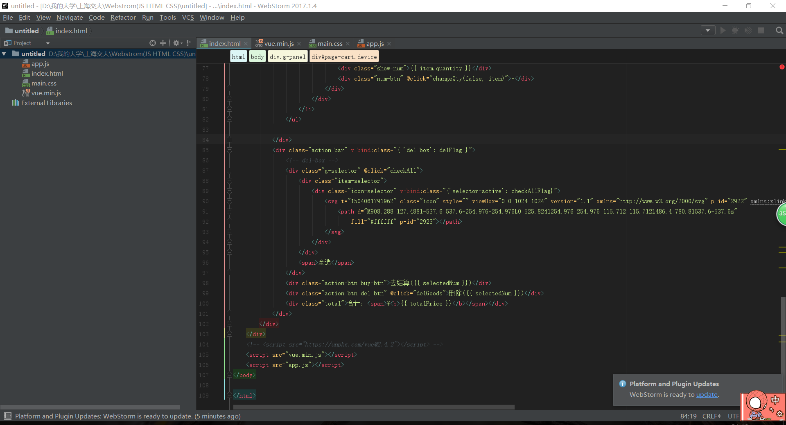

## How to run

Build a project and include all four files in the project.

Then you can run this project on the chrome.

just like this.

## Some information

This is a shopping simulation writen with the "vue.js".

In this small project, I provide the shopping list to choose the commodity and the shopping cart to compute the total price of the commodity.

##Have a good day.